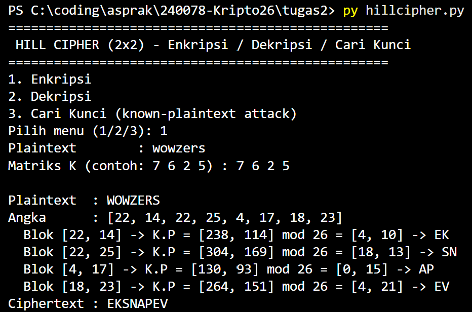
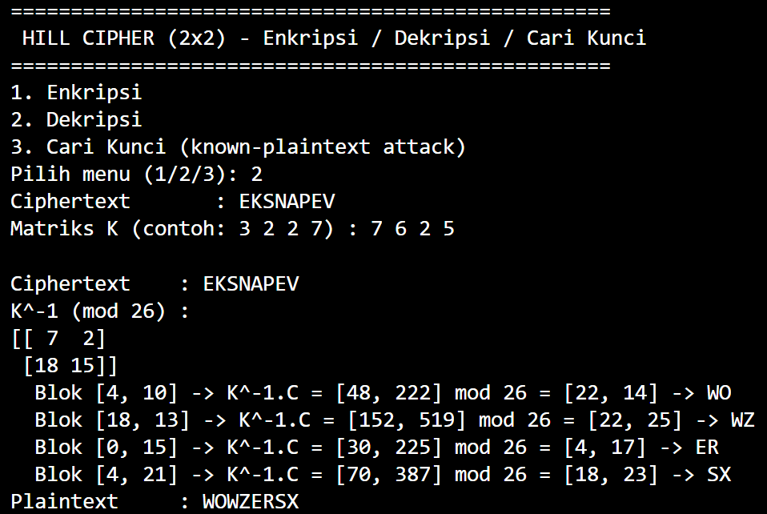
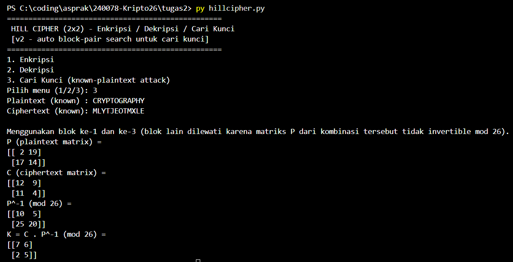

# Hill Cipher (2x2)

Program sederhana untuk melakukan **enkripsi**, **dekripsi**, dan **pencarian kunci** (known-plaintext attack) pada Hill Cipher berordo 2x2. Dibuat menggunakan Python 3 + NumPy.

## Alur Program

1. **Input dibersihkan** (`clean_text`): semua karakter non-huruf dihapus dan teks diubah ke huruf kapital, lalu dikonversi ke angka (A=0, B=1, ..., Z=25) lewat `text_to_nums`.
2. **Enkripsi** (`hill_encrypt`):
   - Plaintext dipecah menjadi blok berukuran 2 (jika jumlah huruf ganjil, otomatis ditambah padding huruf `X`).
   - Setiap blok dikalikan dengan matriks kunci `K`, lalu hasilnya di-*mod* 26 untuk mendapatkan blok ciphertext.
3. **Dekripsi** (`hill_decrypt`):
   - Dicari invers matriks kunci `K^-1 mod 26` melalui `matrix_mod_inverse` (determinan dicari inversnya lewat brute-force `mod_inverse`, lalu dikalikan dengan matriks adjoint).
   - Setiap blok ciphertext dikalikan dengan `K^-1`, di-*mod* 26, untuk mendapatkan kembali blok plaintext.
4. **Cari Kunci** (`hill_find_key`):
   - Diberikan pasangan plaintext dan ciphertext yang diketahui (minimal 4 huruf / 2 blok).
   - Plaintext disusun menjadi matriks `P` (per blok sebagai kolom), ciphertext menjadi matriks `C`.
   - Kunci dicari dengan rumus `K = C . P^-1 (mod 26)`.
5. Program dijalankan lewat menu CLI sederhana (`main()`) yang meminta pengguna memilih mode (enkripsi / dekripsi / cari kunci) dan memasukkan plaintext/ciphertext serta matriks kunci.

## Cara Menjalankan

```bash
pip install numpy
python3 hillcipher.py
```

Lalu pilih menu 1/2/3 sesuai kebutuhan dan masukkan input yang diminta (matriks kunci dimasukkan sebagai 4 angka dipisah spasi, contoh: `7 6 2 5` untuk matriks [[7,6],[2,5]]).

## Pengujian

Program sudah diuji dan hasilnya cocok dengan contoh-contoh pada slide materi:

| Pengujian | Input | Hasil Program | Sesuai Slide? |
|---|---|---|---|
| Enkripsi | `KRIPTO`, K=[[3,2],[2,7]] | `MJCRHG` | Ya |
| Dekripsi | `MJCRHG`, K=[[3,2],[2,7]] | `KRIPTO` | Ya |
| Cari Kunci | Pt=`FRIDAY`, Ct=`PQCFKU` | K=[[7,8],[19,3]] | Ya |
| Enkripsi (Exercise slide 23) | `MAGANG`, K=[[7,6],[2,5]] | `GYQMXE` | Ya (perhitungan manual pada Tugas2_140810240078.pdf) |

## Screenshot Running Program





